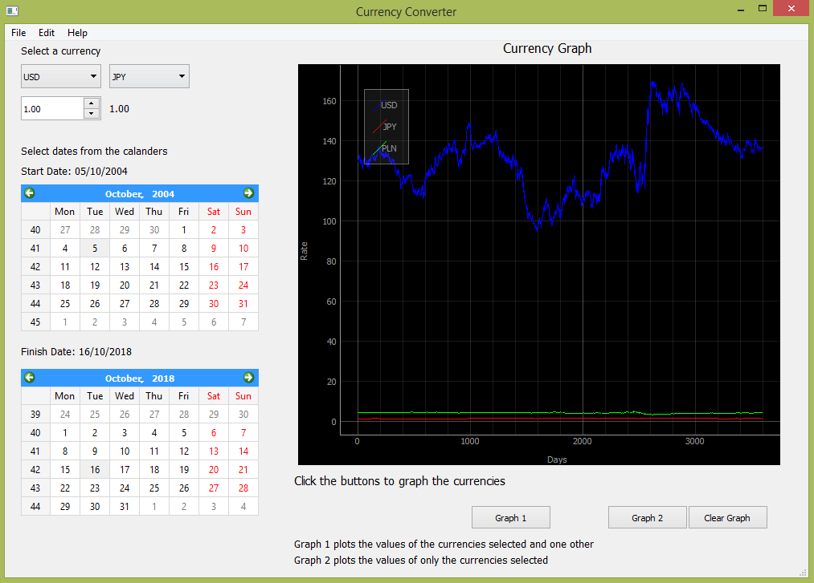

# Currency Converter Python GUI Project
A currency converter with historical exchange rate graphing functionality - PyQt5 GUI 

This application is written in python using PyQt5 and PyQtgraph.

Gets currency exchange data from https://www.ecb.europa.eu and returns as csv file.

Converts currencies by a selected amount, gets the currency values from the data file.

Plots the values of the currency exchange rates to the graph, using dates selected from the calender.

